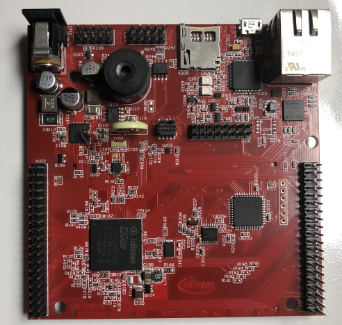
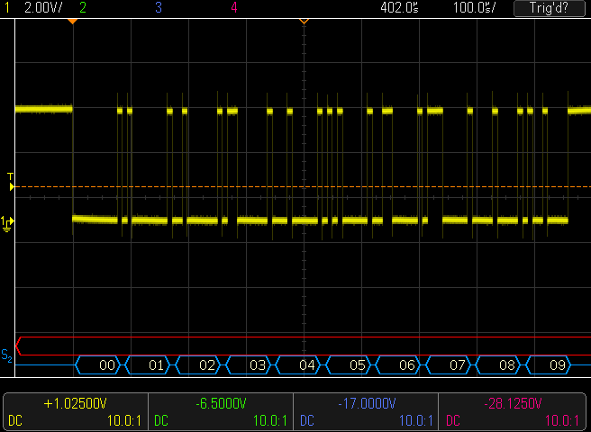

# ADS_TC29x_ASCLIN
## Toolchain: 
AURIX Development Studio (V1.1.10)
## Overview
This project is using reduced set of the iLLD's. However the configurationof the ASCLIN and DMA peripherals are implemented as bare metal. 
## Hardware: 
TC297TP BC TFT kit

### Description
In this code example the ASCLIN3 periheral is configured for a baud rate of 115200 (8-N-1). Port pin P00.0 is the transmit pin and P00.1 is as the receive pin. This code is really only using the CPU0 and is a ver simplifed example to show how to use the DMA to transmit byte based on a user confurable amount. There is a variable called 'test" defined in the file scheduler.c. 

When you run this example in the debugger you it has three choices. 

	/* user testing control, manipulated using a debugger */
	  case 1:
         /* Re-initialize the transmit transfer byte count to the value = to txCnt */
	    ASCLIN3_DMA_Init(txCnt);
	    break;

        case 2:
          /* Initiate the transmit transfer using the transmit FIFO level flag */
          ASCLIN3_FLAGSSET.B.TFLS = 1;
          break;

        case 3:
          /* Initiate the transmit transfer using the SRC interrupt node */
          SRC_ASCLIN3TX.U |= SETR;
          break;

### System Clock
The system clock (PLL) is configured to run at 200MHz.
### Peripeherals Used
#### ASCLIN3 115200 (8-N-1)
#### DMA channels 5 (transmit) and 6 (receive)
#### PORTS P00.0 (Tx) P00.1 (Rx)
### Scope plot of the transfer (channel 1, yellow) is connected to port pin P0.0 

